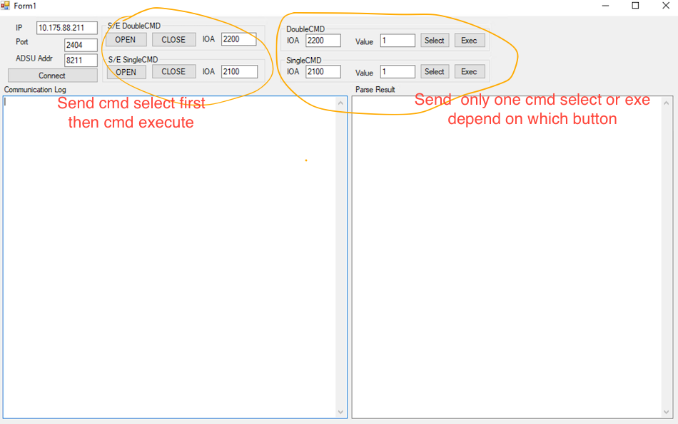

## This Project implement IEC104 master ( tcp client)  protocol

### `Goi lenh Dong/Mo IOA ( double and single command):`

* `Truong hop 1`: Doi voi IOA  yeu cau select before execute thi qua trinh gui cmd dong cat se nhu sau:
        
        1. Gui cmd select IOA (COT = activation)
        2. Gui cmd execute IOA (COT =activation)

* `Truong hop 2:` Doi voi IOA  khong yeu cau select before execute thi chi gui 1 cmd `execute` dong cat  la du, khong can cmd `select`

        1. Gui cmd execute IOA (COT =activation)

### Note :` Doi voi 1 so thiet bi, neu kiem tra truong hop 2(send 1 cmd exe)  ko dong cat duoc,  thi se kiem tra truong hop 1 ( send 2 cmd: 1 sel, 1 exe)`

* Container `DoubleCMD` and  `SingleCMD` chi send tung cmd mot.
* Container `S/E DoubleCMD` and  `S/E SingleCMD`  send 1 cap cmd: cmd `select` first then cmd `execute`

---
Doi voi BR_10R btr thi chi work voi `truong hop 2`: send cmd execute only:
* `To check status` : read IOA double point 200
        
        value= 1 : Open ( khong co dien)
        value= 2 : Close ( dong cau dao)
        
* `To open\close  Option1 use Double cmd ` : send `exec` cmd to Double command IOA 2200

        value= 1 --> recloser will open ( khong co dien)
        value= 2 --> recloser will close ( dong cau dao)

* `To open\close  Option2 use single cmd ` : send `exec` cmd to singe command IOA:

        IOA=2100: value= 1  --> recloser will open
        IOA=2101: value= 1  --> recloser will close

        
---
Doi voi NOJA vp thi chi work voi `truong hop 1`:

